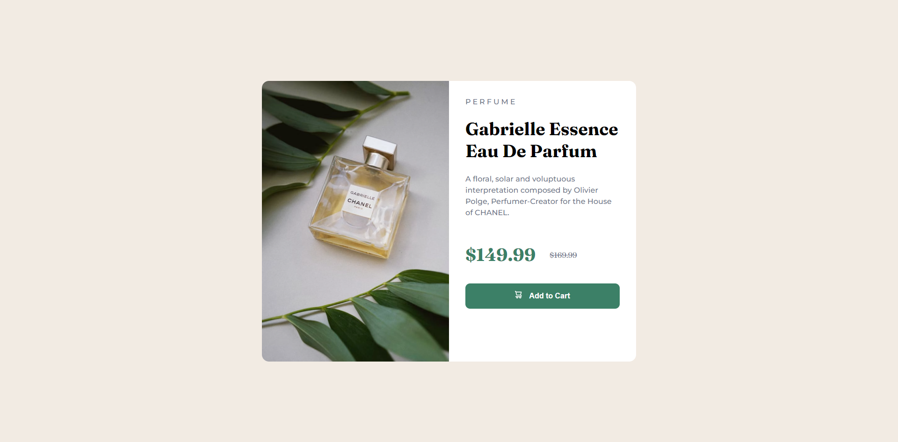

# Frontend Mentor - Product preview card component solution

This is a solution to the [Product preview card component challenge on Frontend Mentor](https://www.frontendmentor.io/challenges/product-preview-card-component-GO7UmttRfa). Frontend Mentor challenges help you improve your coding skills by building realistic projects.

## Table of contents

- [Overview](#overview)
  - [Screenshot](#screenshot)
  - [Links](#links)
- [My process](#my-process)
  - [Built with](#built-with)
  - [Continued development](#continued-development)
  - [Useful resources](#useful-resources)
- [Author](#author)
- [Acknowledgments](#acknowledgments)

## Overview

### Screenshot

This screenshot represents the output of my code.

### Links

- Solution URL: [https://github.com/Coder-Sadik/product-preview-card-component](https://github.com/Coder-Sadik/product-preview-card-component)
- Live Site URL: [https://coder-sadik.github.io/product-preview-card-component/](https://coder-sadik.github.io/product-preview-card-component/)

## My process

This is a very easy and simple task, I have used only HTML and vanila CSS to complete this project.

### Built with

- Semantic HTML5 markup
- CSS custom properties
- Flexbox
- CSS Media Query

### Continued development

I'm participating #100DaysOfCode challenge. This is my day-4. So, I'm hopeful about working on more projects.

### Useful resources

- [Flexbox](https://www.w3schools.com/css/css3_flexbox_container.asp)
- [CSS Media Query](https://www.w3schools.com/tags/tag_ul.asp)

## Author

- Website - [Sadik Rahman](https://github.com/Coder-Sadik)
- Frontend Mentor - [@Coder-Sadik](https://www.frontendmentor.io/profile/Coder-Sadik)
- Twitter - [@SadikRa72105522](https://x.com/SadikRa72105522)

## Acknowledgments

I hereby acknowledge that this project is the result of my own independent work and efforts.
